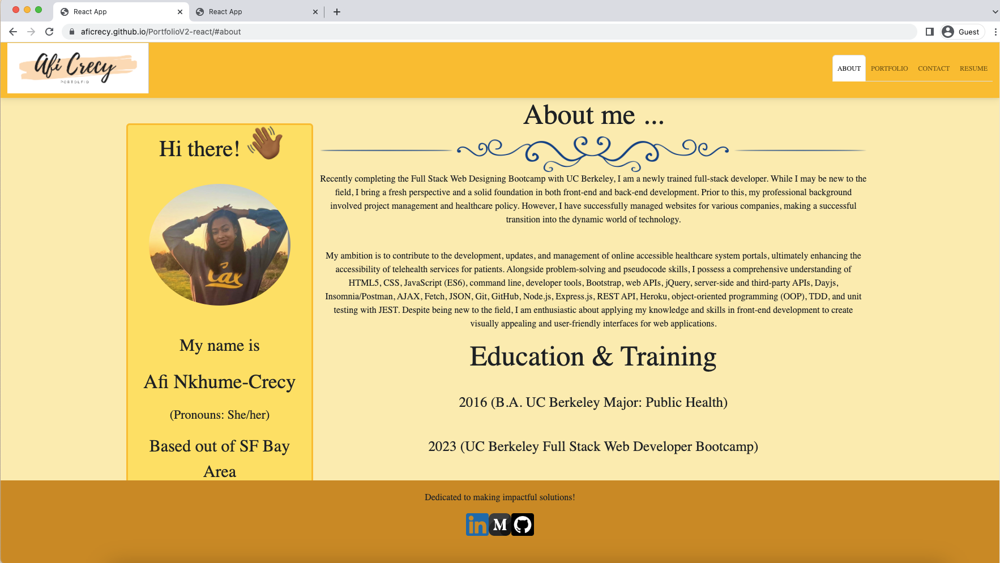

# PortfolioV2 (React Re-make)


## Technology Used:
| Technology Used         | Resource URL           |
| ------------- |:-------------:|
| Git | [https://git-scm.com/](https://git-scm.com/)     |
| JSX    | [https://react.dev/learn/writing-markup-with-jsx](https://react.dev/learn/writing-markup-with-jsx) |
| CSS     | [https://developer.mozilla.org/en-US/docs/Web/CSS](https://developer.mozilla.org/en-US/docs/Web/CSS)      |
| JavaScript  | [https://www.javascript.com/](https://www.javascript.com/)      |
| Node.js | [https://nodejs.org/en](https://nodejs.org/en)      |
| Express.js  | [https://expressjs.com/](https://expressjs.com/)   |
|  Nodemon  |     [https://www.npmjs.com/package/nodemon](https://www.npmjs.com/package/nodemon)   |
| React   |       [https://react.dev/](https://react.dev/)     |
| Google Fonts  |       [https://fonts.google.com/](https://fonts.google.com/)     |
|  MDB (Bootstrap for React)  |   [https://mdbootstrap.com/docs/react/](https://mdbootstrap.com/docs/react/)    |


## Description:

Deployed Application Link:  https://aficrecy.github.io/PortfolioV2-react/

To increase your chances of landing an interview for a software engineering or junior developer position at a reputable technology company or emerging startup, it is vital to leave a lasting impression. Creating an impressive programmer portfolio website is not merely an option, but a necessity. A programmer’s portfolio website serves as a platform for showcasing their previous work samples, allowing them to demonstrate their abilities both through the displayed projects and the website itself. Furthermore, it provides an opportunity to establish your personal brand. That is exactly what I did in re-creating my developer portfolio using a react framework. React as a language, brings together the culmination of HTML, CSS, and JavaScript. My portfolio showcases a single page which can be changed through clicking the different navigation tabs at the top of the page. I have a page for (1) About me detailing who I am and all about my career and education journeys. (2) My actual portfolio section which includes 6 of my previous projects I have worked on. (3) A contact page which holds a form for reaching out as well as my social media information. (4) Lastly, I will showcase my actual resume as well as a list of skills that I’ve acquired. In addition to presenting my work, I infused my website with my unique personality and emphasized my design skills. This can also help potential employers gain insight into my skills to see how I might mesh with their company culture and assess my potential for success in the desired role.


### Screenshot of Functioning Web Application:




## Table of Contents:
* [Description](#description)
* [Installation](#installation) 
<br>
(HTML, CSS, JavaScript, Node.js, NPM Packages, Google Fonts, ReactJS, Express.js, Github Pages, Manifest.json, MDB (Bootstrap for React))
<br>

* [Usage](#usage)
* [Credits](#credits)
* [License](#license)


<p>&nbsp;</p>


### Installation:

To install this project, a knowledge of HTML, CSS, JavaScript, Node.js, Express.js, and ReactJS framework, Git, and Github Pages  were required.  I had to first install Node.js to my computer and then install the Express and NPM packages. I installed the following dependencies with my npm install (express, manifest.json, react, google fonts, mdb react for styling, and nodemon). In order to create this application, a foundational knowledge of HTML, CSS, and JavaScript were required in order to utilize all programming languages on the same code file. This Portfolio is a representation of all of my works that I am confident showcasing to both employers and fellow developers. HTML was used in the form of JSX within a .js file. Additionally, each navigation tab at the top of my portfolio webpage is organized into separate component files which hold the code for each tab. I utilized the MDB React styling framework to organize both my grid layout, forms and input sections, and also within my portfolio tab to create the cards. By combining these technologies, I created a clean and visually pleasing developer portfolio for myself which will serve me in the future as I apply to different companies. The user should be able to navigate to the link of my portfolio and have access to a snippet of who I am and all that I have accomplished so far as a developer. The code below make this happen: 

<p>&nbsp;</p>

### About.js Imports
```js
import React from "react";
import "./About.css";
import personalPhoto from "../../images/personal-photo.png";
import { MDBCol, MDBContainer, MDBRow } from "mdb-react-ui-kit";
import Footer from "../Footer";
```
(Above: This code imports the necessary dependencies for building a React component, including the React library and the required CSS file. It also imports an image file using a relative path and defines MDB (Material Design for Bootstrap) components for later use. Finally, it imports a custom Footer component from a separate file.)

### About.js JSX and MDB
```jsx
function About() {
  return (
    <div className="background">
      <div>
        <MDBContainer>
          <MDBRow>
            <MDBCol size="3" className="aboutme border border-3 rounded pt-6 pr-8 border-warning backgroundcard">
              <h1>
                Hi there! <span className="wave myCustomFontSize"> 👋🏾</span>
              </h1>
              <br />
              </img>
              <p className="text-center pt-5" style={{ fontSize: "30px" }}> My name is</p>
              <p className="text-center" style={{ fontSize: "35px" }}> Afi Nkhume-Crecy</p>
              <p className="text-center" style={{ fontSize: "22px" }}> (Pronouns: She/her)</p>
              <p className="text-center" style={{ fontSize: "30px" }}> Based out of SF Bay Area</p>
            </MDBCol>
            <MDBCol size="9">
              <h1 className="text-center" style={{ fontSize: "50px" }}>
                About me ...
              </h1>
              
              <p>
                {" "}
                Recently completing the Full Stack Web Designing Bootcamp with
                UC Berkeley, I am a newly trained full-stack developer. While I
                may be new to the field, I bring a fresh perspective and a solid
                foundation in both front-end and back-end development. Prior to
                this, my professional background involved project management and
                healthcare policy. However, I have successfully managed websites
                for various companies, making a successful transition into the
                dynamic world of technology.
              </p>
              <br />
              <p>
                My ambition is to contribute to the development, updates, and
                management of online accessible healthcare system portals,
                ultimately enhancing the accessibility of telehealth services
                for patients. Alongside problem-solving and pseudocode skills, I
                possess a comprehensive understanding of HTML5, CSS, JavaScript
                (ES6), command line, developer tools, Bootstrap, web APIs,
                jQuery, server-side and third-party APIs, Dayjs,
                Insomnia/Postman, AJAX, Fetch, JSON, Git, GitHub, Node.js,
                Express.js, REST API, Heroku, object-oriented programming (OOP),
                TDD, and unit testing with JEST. Despite being new to the field,
                I am enthusiastic about applying my knowledge and skills in
                front-end development to create visually appealing and
                user-friendly interfaces for web applications.
              </p>
              <div className="text-center">
                <h2 style={{ fontSize: "50px" }}>Education & Training</h2>
                <br />
                <p style={{ fontSize: "25px" }}>
                  2016 (B.A. UC Berkeley Major: Public Health)
                </p>
                <br />
                <p style={{ fontSize: "25px" }}>
                  2023 (UC Berkeley Full Stack Web Developer Bootcamp)
                </p>
              </div>
            </MDBCol>
          </MDBRow>
        </MDBContainer>
```
(Above: This function defines the About component, which renders a section of the webpage containing information about the author. The component is structured using MDB (Material Design for Bootstrap) grid system with two columns. The left column showcases a profile card with a greeting, personal photo, and details about the author, while the right column provides a detailed description of the author's background, skills, and ambitions. The section also includes a subsection on education and training. The styling is done using CSS classes and inline styles to control font sizes and alignments.)

<p>&nbsp;</p>

### Contact.js Name and Email Regex
```js
function Contact() {
  
  const handleBlur = (e) => {
    if (e.target.name === "name") {
      if (!e.target.value) {
        alert("You need to enter a name.");
      }
    } else if (e.target.name === "email") {
      if (!e.target.value) {
        alert("You need to enter an email.");
      } else {
        const emailReq = /^[a-zA-Z0-9._%+-]+@[a-zA-Z0-9.-]+\.[a-zA-Z]{2,}$/;
       if (!emailReq.test(String(e.target.value).toLowerCase())) {
        alert("You need to enter a valid email adress.");
       }
      } 
    } else if (e.target.name === "message") {
      if (!e.target.value) {
        alert("You need to enter a message.");
      }
    }
  }
  const handleSubmit = (e) => {
    alert('Successfully submitted')
  }
}
```
(Above: This code defines a Contact component that handles form validation and submission. The handleBlur function is triggered when the user leaves a form input field. It checks if the name, email, or message field is empty and displays an alert message accordingly. It also validates the email format using a regular expression. The handleSubmit function is triggered when the form is submitted and displays a success alert.)

<p>&nbsp;</p>

### Portfolio.js Cards (JSX & MDB) 
```js
import React from "react";
import {
  MDBRow,
  MDBCol,
  MDBCardBody,
  MDBCardTitle,
  MDBCardText,
  MDBCardImage,
} from "mdb-react-ui-kit";
import Footer from "../Footer";
import "./Portfolio.css";
import cinexplorerImg from "../../images/Cinexplorer.png";
import featherPadImg from "../../images/FeatherPad-image.png";
import hopsHavenImg from "../../images/Hops-Haven-Logo.png";
import theBloggersDenImg from "../../images/TheBloggersDen-image.png";
import workDayPlannerImg from "../../images/WorkDayPlanner-image.png";
import weatherProImg from "../../images/WeatherPro-image.png";

function Portfolio() {
  return (
    <div style={{ backgroundColor: '#fdedb3'}}>
      <h1 style={{ fontSize: "55px"}}>Portfolio</h1>
      <h2 className="text-center pb-4">Previous projects I've worked on...</h2>
      <MDBRow className="Card">
        <MDBCol size="4">
          <a
            href="https://codenamenoah.github.io/Movie-Indexer/"
            target="_blank"
            rel="noreferrer"
          >
            <MDBCardImage
              className="CardBody"
              src={cinexplorerImg}
              position="top"
              alt="..."
            />
          </a>
          <MDBCardBody className="CardBody">
           <MDBCardTitle className='pt-4'>Cinexplorer Movie Search</MDBCardTitle>
            <MDBCardText>
            <a href="https://github.com/CodeNameNoah/Movie-Indexer" target="_blank"
            rel="noreferrer">(Link to repository)</a>  
            <br/>
            I am excited to tell you about the application my team and I made for movie enthusiasts. Our application is designed to provide users with an easy and efficient way to search for information about their favorite movies. This application utilizes OMDb's Movie API.
            </MDBCardText>
          </MDBCardBody>
        </MDBCol>
 } )
 ```
 (Above: The Portfolio component displays a collection of previous projects. It imports dependencies for building card components, as well as the Footer component and a CSS file for styling. Images related to each project are also imported. The component renders a section with a background color, a heading, and a subheading. It uses card components to display each project, including an image, a title linked to the project's repository, and a description. Styling is applied using CSS classes and inline styles.)

<p>&nbsp;</p>

 ### Resume.js (MDB Buttons)
 ```js
 function Resume() {
    return (
      <div className='background'>
      <MDBContainer>
  <MDBRow>
    <MDBCol size='6'>
      <h1 className="text-center resume_heading">Resume</h1>
      <a
                    href={resumePdf}
                    target="_blank"
                    rel="noreferrer"
                    download='Afi-resume'
                  >
                    
                  </a>
    </MDBCol>
    <MDBCol size='6' >
      <h1 className="text-center skills">Skills</h1>
        <div >
          <MDBBtn >HTML</MDBBtn>
          <MDBBtn >Javascript</MDBBtn>
          <MDBBtn >CSS </MDBBtn>
          <MDBBtn >Git</MDBBtn>
          <MDBBtn>React</MDBBtn>
        </div>

        <div>
          <MDBBtn>Node.js</MDBBtn>
          <MDBBtn>Express.js</MDBBtn>
          <MDBBtn>MongoDB</MDBBtn>
          <MDBBtn>GraphQL</MDBBtn>
        </div>
        <div>
          <MDBBtn>Heroku</MDBBtn>
          <MDBBtn>MVC Framework</MDBBtn>
          <MDBBtn>Insomnia</MDBBtn>
        </div>
        <div>

          <MDBBtn>Web API's</MDBBtn>
          <MDBBtn>Server-Side API's</MDBBtn>
          <MDBBtn>MERN</MDBBtn>
          </div>
          <MDBBtn>SQL</MDBBtn>
          <MDBBtn>Python</MDBBtn>
      </MDBCol>
      </MDBRow>
</MDBContainer>
      <Footer/>
  </div>
    )
}
```
(Above: The Resume component renders a section that displays a resume and a list of skills. It imports dependencies from the mdb-react-ui-kit library for building the layout. The resume is displayed as an image, which can be downloaded by clicking the image. The skills section is divided into several groups, with each group containing buttons representing different skills. The component also includes the Footer component to display additional information at the bottom.)

<p>&nbsp;</p>

### Header.js Image and NavTabs
```js
  return (
    <MDBNavbar className='navbar' expand='lg' light bgColor='warning'>
      <MDBContainer fluid>
      <a href='https://aficrecy.github.io/PortfolioV2-react/#about'></a> 
        <MDBNavbarToggler
          type='button'
          data-target='#navbarRightAlignExample'
          aria-controls='navbarRightAlignExample'
          aria-expanded='false'
          aria-label='Toggle navigation'
          onClick={() => setShowNavRight(!showNavRight)}
        >
          <MDBIcon icon='bars' fas />
        </MDBNavbarToggler>

        <MDBCollapse navbar show={showNavRight}>
          <MDBNavbarNav right fullWidth={false} className='mb-2 mb-lg-0'>
            <NavTabs currentPage={currentPage} handlePageChange={handlePageChange}/>
          
          </MDBNavbarNav>
        </MDBCollapse>
      </MDBContainer>
    </MDBNavbar>
  );
}
```
(Above: The Header component is responsible for rendering the navigation bar at the top of the page. It imports a portfolio logo image and the NavTabs component for navigation links. The component uses state to control the visibility of the navigation bar on smaller screens. The navigation bar is built using the mdb-react-ui-kit library, with a logo, a toggler button to show/hide the navigation links, and a collapsible section that contains the navigation links. The current page and a function to handle page changes are passed as props to the NavTabs component.)


<p>&nbsp;</p>

## Usage

A well-curated programming portfolio effectively highlights your experience, past projects, skills, and pertinent information sought by employers. By compiling your projects, employment history, educational background, and a brief introduction, you can showcase your capabilities to prospective employers. Emphasizing your notable work and providing concise explanations for each project within your portfolio serves as concrete evidence of your abilities and demonstrates your commitment to continuous learning and growth in the field, helping you stand out and increase your credibility among other candidates. In today's industry, coding portfolios have become a crucial tool for professionals to showcase their unique skills and expertise. As employers increasingly expect candidates to have portfolios, it is essential to be prepared and have a well-developed portfolio to meet these expectations.

## Credits

* Create React Project: https://react.dev/learn/start-a-new-react-project
* React Components: https://react.dev/reference/react/Component
* Components: https://react.dev/reference/react/Component#props
* Components & Props: https://legacy.reactjs.org/docs/components-and-props.html
* Learning Components: https://react.dev/learn/your-first-component
* React Keys & Lists: https://legacy.reactjs.org/docs/lists-and-keys.html
* Form Components: https://react.dev/reference/react-dom/components#form-components
* React Bootstrap Cards: https://mdbootstrap.com/docs/react/components/cards/
* React Bootstrap Buttons: https://mdbootstrap.com/docs/react/components/buttons/
* React Bootstrap Grid Layout: https://mdbootstrap.com/docs/react/layout/grid/
* React Bootstrap Columns: https://mdbootstrap.com/docs/react/layout/columns/
* React Using Effect Hook: https://legacy.reactjs.org/docs/hooks-effect.html
* React useState: https://react.dev/reference/react/useState
* React Navigation Bar: https://mdbootstrap.com/docs/react/navigation/navbar/
* React Headers: https://mdbootstrap.com/docs/react/navigation/headers/ 
* React Footers: https://mdbootstrap.com/docs/react/navigation/footer/ 


<p>&nbsp;</p>


### License:
MIT License

Copyright (c) [2023] [Afi Nkhume-Crecy]

Permission is hereby granted, free of charge, to any person obtaining a copy
of this software and associated documentation files (the "Software"), to deal
in the Software without restriction, including without limitation the rights
to use, copy, modify, merge, publish, distribute, sublicense, and/or sell
copies of the Software, and to permit persons to whom the Software is
furnished to do so, subject to the following conditions:

The above copyright notice and this permission notice shall be included in all
copies or substantial portions of the Software.

THE SOFTWARE IS PROVIDED "AS IS", WITHOUT WARRANTY OF ANY KIND, EXPRESS OR
IMPLIED, INCLUDING BUT NOT LIMITED TO THE WARRANTIES OF MERCHANTABILITY,


